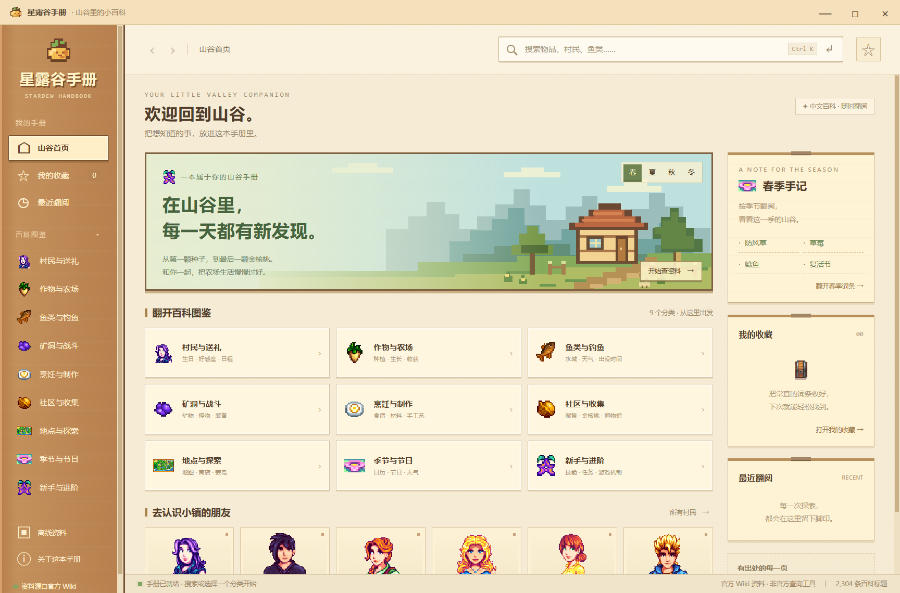

# 星露谷手册

[](https://github.com/shguild/stardew-handbook/actions/workflows/ci.yml)

Windows 桌面查询工具，资料来自星露谷物语官方中文 Wiki，界面采用像素风山景、木质边框和羊皮纸面板。

普通使用者请在 [最新版本下载](https://github.com/shguild/stardew-handbook/releases/latest) 页面下载名称含 **Setup** 的安装 EXE；克隆源码用于开发时，按下方开发步骤运行。更新流程和目录说明见 [开发与更新](CONTRIBUTING.md)，历史变化见 [更新记录](CHANGELOG.md)。

## 运行

推荐安装版：双击 `dist/Stardew-Handbook-1.0.2-Setup-Windows-x64.exe`，按照中文向导安装，之后从桌面或开始菜单打开「星露谷手册」。适用于 Windows 10/11 的 x64 电脑。

发给别人时只需发送这一份安装 EXE，不需要同时发送源码、文件夹或游戏文件。安装包包含完整运行环境，无需另外安装 Node.js、Python 或星露谷物语游戏。

默认安装到当前用户的程序目录，可选择其他安装位置，通常不需要管理员权限。可从 Windows「设置 → 应用 → 已安装的应用」中卸载；卸载保留收藏、阅读历史和缓存，重装后可继续使用。

程序和安装包未进行商业代码签名，Windows 可能显示未知发布者或 SmartScreen 提示。请核对文件来自可信来源。首次访问未缓存的词条需要联网，随附的 16 个基础词条可离线阅读。

便携版仍可直接运行 `dist/Stardew-Handbook-1.0.2-Windows-x64.exe`，首次解压启动可能需要数秒。

也可以使用 `dist/win-unpacked/星露谷手册.exe`；该目录中的运行时文件必须一起保留，不能只拷贝其中的 exe。

## 功能

1.0.2 新增中文安装版、安装目录选择、桌面和开始菜单快捷方式、Windows 卸载入口，并写入程序自己的图标与版本信息。保留 1.0.1 的全部正文修复。

1.0.1 统一修复所有词条中的 `data-sort-value="…"` 排序代码，包括鱼、四季、农作物、果树、旅行货车、星露谷展览会等。已清理附带资料，读取旧缓存时也会自动移除排序辅助字段；无需清理缓存，收藏和阅读历史会保留。



- 中文标题即时建议、官方 Wiki 全文搜索与分页。
- 九类百科导航、季节入口、村民头像快捷查询。
- 词条正文、图片、表格、目录、内部跳转、字号调整和官方原文链接。
- 收藏、最近阅读、前后导航与本机保存。
- 正文自动缓存、图片按需缓存、联网失败时回退到缓存。
- 随程序附带官方标题索引及少量官方基础词条。

基础缓存并非全站离线镜像。首次阅读未缓存词条和在线全文搜索需要网络；离线搜索采用标题匹配。缓存显示抓取时间，并可手动刷新。已下载的图片可以离线使用，没有下载的图片可能暂时缺失。

快捷键：Ctrl + K 聚焦搜索；↑ / ↓ 选择建议；Enter 打开或搜索；Alt + ← / → 前后导航；Esc 收起建议。

收藏、历史、设置、词条和图片缓存保存在 `%APPDATA%/stardew-handbook/`（以 Electron 实际 userData 目录为准）。应用内「离线资料」可以查看、清理下载缓存，收藏和基础资料会保留。

## 开发与构建

```powershell
npm ci
npm start
npm test
npm run test:ui
node scripts/smoke.cjs --packaged
node scripts/fish-smoke.cjs --packaged
node scripts/articles-smoke.cjs --packaged
node scripts/portable-smoke.cjs
.\scripts\installer-smoke.ps1
npm run bootstrap
npm run build
npm run build:installer
npm run build:portable
npm run release:prepare
```

需要 Node.js 24+。`bootstrap` 从官方 Wiki 下载标题索引、基础词条和图像，保留来源清单；不要无意义地频繁运行。依赖安装须允许 Electron 下载其运行时。`build` 同时生成安装版与便携版，两个单独命令可按需构建。

安装包采用 NSIS。`installer-smoke.ps1` 会在项目的独立测试目录中执行安装、启动、卸载与重装，临时创建当前用户的快捷方式和安装注册记录，并在结束时卸载测试程序。若检测到已有同名安装、快捷方式或正在运行的程序，会拒绝测试，避免覆盖。

开发者可设置 `HANDBOOK_TEST_DIR` 将测试用户数据隔离到指定目录；`HANDBOOK_TEST_HIDDEN=1` 让自动化测试窗口保持隐藏；`HANDBOOK_TEST_OFFLINE=1` 只用于离线验证。这些变量通常无需设置。

跨词条检查记录见 `docs/ARTICLE_AUDIT.md`。需要重新检查官网正文时，可运行 `electron scripts/audit-articles.cjs`；添加 `--cached` 可复查上次的原始响应，避免重复访问官网。

## 资料和许可

本程序为非官方资料工具，不读取游戏存档。原创程序代码与自绘装饰为 MIT；Wiki 内容为 CC BY-NC-SA 3.0；游戏图像归 ConcernedApe。各页面保留原文链接与抓取时间。详细说明见 `THIRD_PARTY_NOTICES.md` 和 `data/sources.json`。

官方中文 Wiki：https://zh.stardewvalleywiki.com/Stardew_Valley_Wiki
